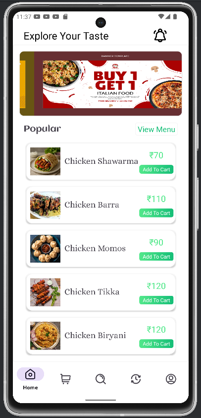
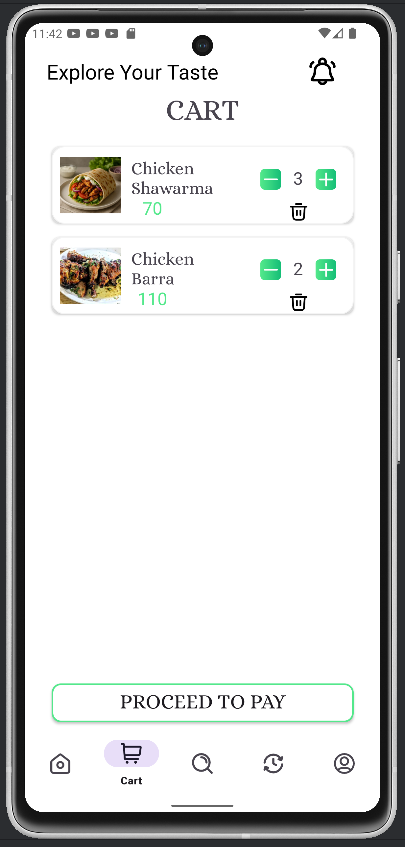
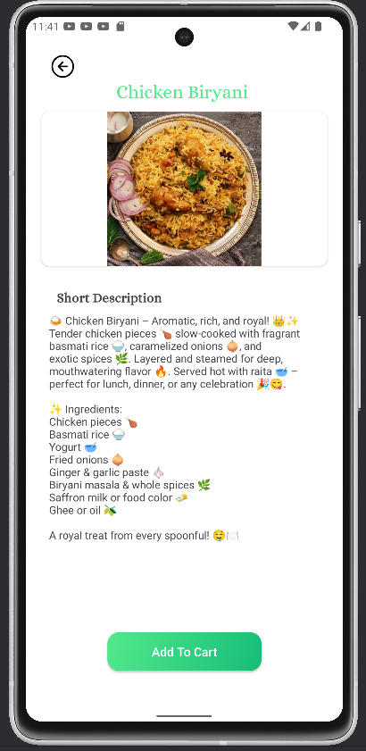
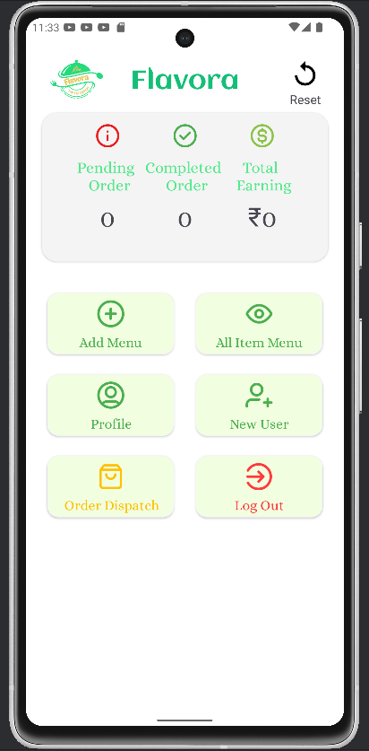
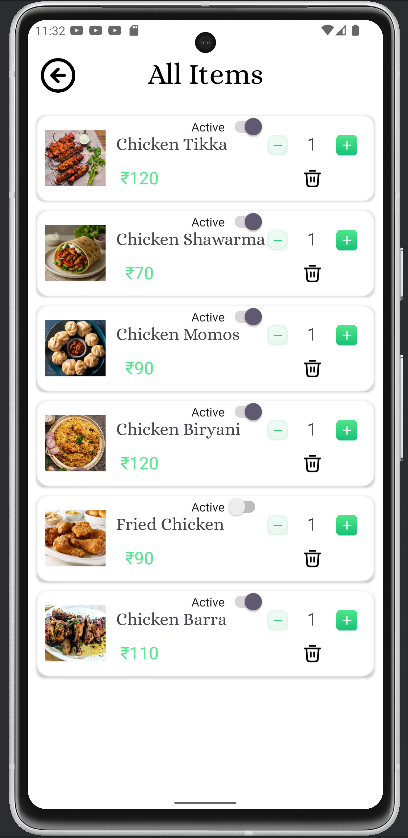

🍽️✨ FLAVORA – Smart & Scalable Food Delivery App
Welcome to FLAVORA, a modern food delivery solution crafted specially for a single restaurant — but built with scalability in mind to power many more in the future! 🚀
Currently, FLAVORA has two apps working together:

📱 User App – for customers to order food

🛠️ Admin App – for restaurant staff to manage menu & orders

Built with simplicity, speed, and future growth in mind! 🌱🍔

📦 Project Structure
FLAVORA/
 ├── admin-app/    📦 Android project for Admins
 └── user-app/     📦 Android project for Users
📲 User App – Features
✅ Clean, modern UI – Browse delicious dishes by categories (Biryani, Momos, Shawarma, etc.)
🍽️ Add to Cart & Place Orders – Quick, intuitive ordering flow
📦 Live Order Tracking – Track your order’s status in real-time
📝 Order History – View past orders anytime
🔒 Authentication – Sign in with Google or Email/Password
💵 Cash on Delivery – No payment gateway yet; built for offline payment
🌱 Scalable Design – Ready to support multiple restaurants in future

🛠️ Admin App – Features
📋 Add / Edit / Remove Menu Items – Manage menu dynamically
🚚 Manage Orders – View incoming orders, update status (Preparing, Ready, Delivered, etc.)
📊 Dashboard – See number of orders & sales data
🛠 Firebase Integration – Realtime updates across user & admin apps

🔧 Tech Stack
Frontend (Android): Kotlin

Backend: Firebase Realtime Database & Cloud Storage

Auth: Firebase Authentication (Google & Email/Password)

Push Notifications: Firebase Cloud Messaging (planned)

Design: Material Design principles 🎨

⚙️ Setup & Installation
Clone the repository:
git clone https://github.com/Ariifff/flavora.git
Open both admin-app and user-app projects in Android Studio.

Add your Firebase configuration files (google-services.json) to both apps.

Enable Firebase Authentication, Realtime Database & Storage in the Firebase console.

Build & run! 🚀

🌱 Current Scope & Future Roadmap
✅ Now:

Single restaurant

Cash on Delivery only

Basic order management & tracking

🔮 Planned / Future:

Payment gateway integration (UPI, cards, wallets)

Support for multiple restaurants & outlets

Loyalty programs, coupons, and promotions

AI-based food recommendations

Cloud kitchens & franchise support

✏️ Customization Guide
Menu Items: Change directly in Firebase Database (admin app makes this easier)

Branding: Update logo, splash screens & colors in res/drawable and res/values

Restaurant Info: Edit strings in strings.xml or Firebase

## 📸 Screenshots

| 🏠 User Home | 🛒 Cart | 🍗 Item Details | 🛠️ Admin Dashboard | 📋 Manage Menu |
|:--:|:--:|:--:|:--:|:--:|
|  |  |  |  |  |

❤️ Why FLAVORA?
Focused & lightweight – perfect for single restaurants and cloud kitchens

Designed to scale seamlessly in the future

Modern UI/UX for better customer experience

Powerful admin tools for restaurant owners

Built using reliable & flexible Firebase backend

🤝 Contributing
Have ideas to make FLAVORA even better?
Feel free to fork, open issues, or create pull requests! Contributions are welcome! 🌟

📧 Contact
📩 Email: arifrainee1@gmail.com
📍 Made with ❤️ by Arif

⚡ FLAVORA – From one kitchen today to many tomorrow.
Taste meets technology! 🍲🚀
